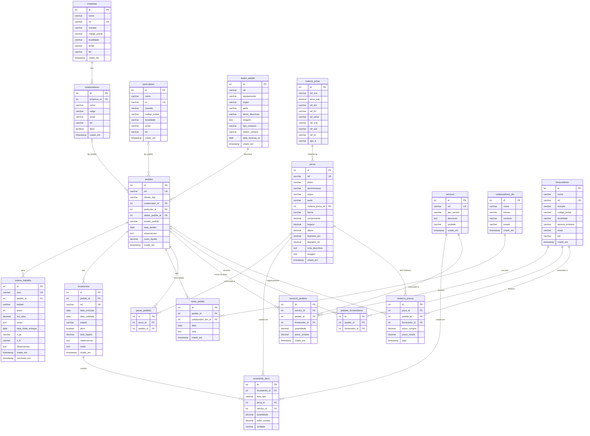

# Diagrama de Relações — MaquinaGest

## Legenda das relações

| Símbolo | Significado |
|---------|-------------|
| `\|\|` | Exactamente um (obrigatório) |
| `\|o` | Zero ou um (opcional) |
| `o{` | Zero ou muitos |
| `\|{` | Um ou muitos |

## Tabelas de ligação (N:M)

| Tabela | Liga |
|--------|------|
| `pecas_pedidos` | `pecas` ↔ `pedidos` |
| `servicos_pedidos` | `servicos` ↔ `pedidos` (+ fornecedor opcional) |
| `pedidos_fornecedores` | `pedidos` ↔ `fornecedores` |
| `orcamento_itens` | `orcamentos` ↔ `pecas` ou `servicos` |
| `historico_precos` | `pecas` ↔ `pedidos` (+ fornecedor opcional) |

## Nota sobre clientes

`pedidos.cliente_tipo` determina qual FK está preenchida:
- `'colaborador'` → `colaborador_id` preenchido, `particular_id` NULL
- `'particular'` → `particular_id` preenchido, `colaborador_id` NULL

`colaboradores_dm` são a **equipa interna** da oficina — não são clientes.
